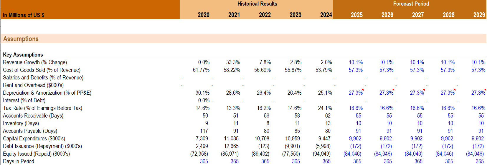

# Apple 3-Statement Financial Model

This project is a 3-statement financial model for Apple Inc. built in Excel. The model includes historical financial data, forecast assumptions, projected financial statements, supporting schedules, and charts.

## Project Overview

The purpose of this model is to practice and demonstrate financial modeling skills, including:

* Building an income statement forecast
* Building a balance sheet forecast
* Building a cash flow statement forecast
* Creating supporting schedules
* Linking financial statements together
* Using assumptions to drive forecast years
* Creating charts to summarize financial performance

## Model Includes

* Historical and forecasted income statement
* Historical and forecasted balance sheet
* Historical and forecasted cash flow statement
* Working capital schedule
* Depreciation schedule
* Debt and interest schedule
* Revenue and gross profit margin chart
* Cash flow chart

## Key Forecast Assumptions

The forecast is based on historical averages and model assumptions, including:

* Revenue growth
* Cost of goods sold as a percentage of revenue
* Depreciation and amortization as a percentage of PP&E
* Tax rate
* Working capital days
* Capital expenditures
* Debt issuance and repayment
* Equity issuance and repurchases

## Skills Demonstrated

* Excel financial modeling
* 3-statement modeling
* Forecasting
* Financial statement analysis
* Supporting schedule construction
* Formula linking and auditing
* Chart creation and presentation

## Notes

This model was created for learning and portfolio purposes. Forecasts are based on simplified assumptions and should not be interpreted as investment advice.

## Model Preview

### Assumptions

### Income Statement

### Balance Sheet

### Cash Flow Statement

### Supporting Schedules

### Charts and Graphs

